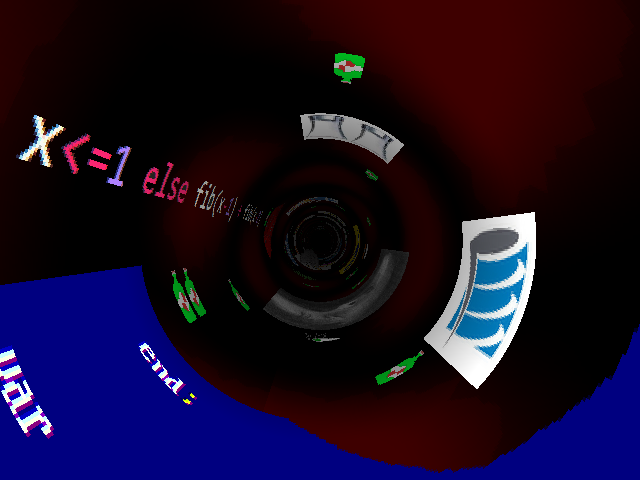

# anim-tunnel-utbm

Une petite vidéo réalisée avec python et pygame, pour les 20 ans de l'UTBM.

Licence libre CC-BY.

Vous pouvez la visionner directement ici : https://drive.google.com/file/d/1JoAm1r8XzYISfwMgxuTC3zVYmDcyRcpE/view .

Elle a été créée dans le cadre des "vidéos-boulettes" pour le gala de l'UTBM. Plus de détails ici : https://www.facebook.com/GalaAeUTBM/posts/2773072979403412 .

La compilation complète de toutes les vidéos est disponible ici : https://m.youtube.com/watch?feature=youtu.be&v=nklfDfxYmhI .

Les explications concernant les voix et les images placées dans le tunnel sont dans cet article de blog : https://recher.wordpress.com/2019/11/24/les-details-dans-ma-video-pour-lutbm .

## Credits

La musique de fond provient du thème de La Soupe Aux Choux. Elle a été récupérée depuis cette vidéo : https://www.youtube.com/watch?v=UBBOe6T2wdY .

Le son a été extrait avec l'outil https://www.audioextracter.com/ .

Certaines images sont de moi, d'autres appartiennent à leurs auteurs respectifs. Désolé, je n'ai pas gardé les sources.

## Pour jouer la vidéo

Testé sous Windows. À priori, ça fonctionne aussi sur Mac, car python et les librairies utilisées sont multi-plateformes.

### Python

Installez le langage de programmation python, version 3.6.8 ou une version supérieure. Pas de python 2.x, car ce n'est pas compatible. https://www.python.org/

### Pygame

Installez la librairie pygame. https://www.pygame.org/news .

Le plus simple est d'exécuter la commande suivante, dans un terminal :

`python3 -m pip install -U pygame`

Si vous n'avez pas les droits d'admin sur votre ordinateur, essayez avec cette commande :

`python3 -m pip install -U pygame --user`

Il est conseillé de créer un virtual env avant d'installer la librairie, ce que j'avais fait. Mais étrangement, au moment de l'installation, la librairie s'est placée dans l'environnement python principal, et non pas dans mon virtual env. (Je me suis peut-être trompé quelque part).

Ça marchera, même si vous ne faites pas de virtual env.

### Numpy

Installer la librarie numpy (calcul matriciel en python). https://numpy.org/

`python -m pip install numpy`

Si vous n'avez pas les droits, essayez avec cette commande :

`python -m pip install numpy --user`

### Lancer la vidéo

Téléchargez ou clonez ce repository. Bouton vert "clone or download" en haut à droite de cette page web. Dézipper le fichier obtenu sur votre disque dur.

Dans une console de commande, placez-vous dans le répertoire du repository dézippé.

Exécutez la commande : `python tunnel.py`

La vidéo va se lancer, avec un temps d'attente de 10 secondes au début. J'avais besoin de cette attente, pour avoir le temps de déclencher l'enregistrement de l'animation dans un fichier vidéo.

Pour démarrer sans le temps d'attente, il faut le préciser en paramètre. Exécutez la commande : `python tunnel.py 0`

## Mouvement de la boulette de papier

La boulette de papier ne se déplace pas exactement de la même manière que dans la version de la vidéo envoyée à l'UTBM. Entre temps, j'ai repris le code et j'ai corrigé un bug.

Si vous voulez lancer la version correspondant à celle de l'UTBM, il faut se placer sur le commit de la release "v1.0".

Installer git sur votre ordinateur. https://git-scm.com/download/win .

Clonez le repository avec la commande : `git clone https://github.com/darkrecher/anim-tunnel-utbm.git`

Aller dans le repository : `cd anim-tunnel-utbm`

Positionnez-vous sur le bon commit : `git checkout 86e44d4`

Et pour finir, lancez la vidéo : `python tunnel.py`

